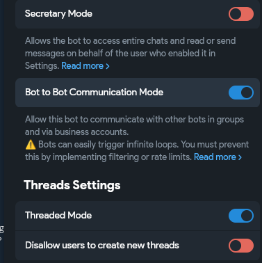
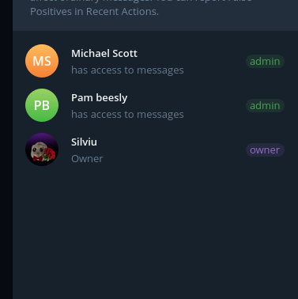

# RUNBOOK — Agenți Office pe Telegram (Hermes + Gemini)

Doi (sau mai mulți) agenți AI care colaborează pe Telegram, în stil *The Office*:
- **Michael Scott** — CEO/manager. Vorbești cu el; el deleagă și aprobă.
- **Pam Beesly** — artistă; generează imagini cu Google Gemini (Nano Banana Pro).

Acest document descrie **doar ce a funcționat** (configurația finală verificată). E împărțit clar în:
- **Partea A — ce faci TU în Telegram** (BotFather, grup, topicuri).
- **Partea B — ce face Claude Code** (profiluri Hermes, config, skill-uri, scripturi).

> Construit cu [Hermes Agent](https://github.com/NousResearch/hermes-agent) (Nous Research) + [Google AI Studio / Gemini](https://aistudio.google.com/apikey). Comunicarea boților e prin **bot-to-bot nativ Telegram** (Bot API 10.0).

---

## 1. Arhitectura

Grup Telegram de tip **forum** (cu topicuri). Două topicuri:

```
        ┌──────────────── Grup Telegram (forum) ────────────────┐
        │                                                        │
        │   Topic GENERAL                 Topic ART              │
        │   ───────────────               ─────────              │
        │   TU ⇄ Michael (CEO)            Michael ⇄ Pam          │
        │         │                          ▲     │             │
        │   "fă-mi un poster"                │     │ generează   │
        │         │  clarifică/brief          │     ▼ imaginea    │
        │         └── deleagă ───(skill)──► @Pam ROUND n         │
        │                                    │     │             │
        │   imaginea finală ◄──(send_message)│     │ review      │
        │   apare în General ◄───────────────┘◄────┘ pushback    │
        └────────────────────────────────────────────────────────┘
```

**Regula de aur anti-buclă:** un singur bot e „liber" (CEO Michael, `require_mention=false`); toți workerii sunt „gated" (`require_mention=true`) și fiecare stă în topicul lui. Workerii nu vorbesc între ei — totul trece prin CEO. Astfel bucla infinită e **imposibilă structural** și scalează la N agenți.

**Handoff determinist:** Michael NU tastează niciodată `@pam` în text (Gemini Flash uită) — deleagă printr-un **skill** care pune mențiunea + topicul + numărul rundei hardcodate și impune un **cap dur de 3 runde**.

### Exemple de rezultate (generate de Pam, livrate de Michael în General)


Alte exemple: [exemplu-poster-2.png](assets/exemplu-poster-2.png),
[exemplu-poster-3.png](assets/exemplu-poster-3.png). Observă textul românesc randat corect
(„CEL MAI TARE ȘEF") — vezi tehnica de prompt în §10 / skill-ul `image-studio`.

---

## 2. Prerechizite

| Componentă | Detaliu |
|---|---|
| Hermes Agent | instalat (CLI `hermes`); rulează pe venv-ul propriu Python 3.11 (`~/.hermes/hermes-agent/venv/`) |
| `google-genai` | instalat ÎN venv-ul Hermes (nu în Python-ul sistemului) |
| `psutil` | instalat în venv (pentru launcher-ul cross-platform) |
| Cheie Google AI Studio | de la https://aistudio.google.com/apikey (free tier ~500 imagini/zi) |
| Cont Telegram | pentru BotFather + grup |

Instalare deps în venv:
```bash
VENV=~/.hermes/hermes-agent/venv/bin/python      # (Win: ...\venv\Scripts\python.exe)
uv pip install --python "$VENV" google-genai psutil
# sau:  "$VENV" -m pip install google-genai psutil
```

---

## 3. PARTEA A — Ce faci TU în Telegram (pași manuali)

Claude Code NU poate face acești pași (sunt interactivi, în contul tău). Îi faci o singură dată.

### 3.1. Creează cei 2 boți în @BotFather
În Telegram, deschide **@BotFather**:
```
/newbot
  Name:      Michael Scott
  Username:  <ceva unic care se TERMINĂ în "bot">   ex: michael_scott_dm_bot
  → salvează TOKEN-ul (MICHAEL_TOKEN)

/newbot
  Name:      Pam Beesly
  Username:  <unic, se termină în "bot">             ex: pam_beesly_art_bot
  → salvează TOKEN-ul (PAM_TOKEN)
```
> ⚠️ Username-ul TREBUIE să se termine în `bot` — Telegram cere asta, iar Hermes recunoaște mențiunea de bot doar pentru handle-uri `…bot`.

### 3.2. Privacy OFF + Bot-to-Bot Mode ON (pe AMBII boți)
Pentru **fiecare** bot:
```
/setprivacy → alege botul → Disable
```
Apoi, tot pentru fiecare bot, în **Bot Settings**, activează **Bot-to-Bot Communication Mode** (Bot API 10.0). Arată așa:



> Acesta e gate-ul real care permite unui bot să „vadă" mesajele altui bot în grup. Fără el, Michael și Pam nu se aud.

### 3.3. Creează grupul-forum și adaugă boții ca admini
1. Creează un **grup** și activează **Topics** (devine forum). Ex: „The Office (WIZARD)".
2. Adaugă în grup: **tine + ambii boți**.
3. Promovează **ambii boți la Administrator** (Manage group → Administrators). Fiind admini, văd toate mesajele din grup.



4. Vei avea două topicuri: **General** (implicit) și creează unul nou numit **Art**.

### 3.4. Dă-i lui Claude Code: cheia + token-urile
Când rulezi skill-ul, Claude îți va cere (și le scrie doar în `.env`, niciodată în doc/skill):
- `GOOGLE_API_KEY` (cheia AI Studio)
- `MICHAEL_TOKEN`, `PAM_TOKEN`
- (id-ul grupului `-100…` îl ia Claude singur din `getUpdates` după ce trimiți un mesaj în grup)

---

## 4. PARTEA B — Ce face Claude Code (automat)

Claude execută pașii de mai jos (skill-ul `reproducere-agenti-office` îi face singur, cu pauze pentru Partea A).

### 4.1. Creează 2 profiluri Hermes (clonate din `default`, neatins)
```bash
hermes profile create michael --clone --description "Michael Scott: CEO/manager"
hermes profile create pam     --clone --description "Pam Beesly: artistă imagini Gemini"
```
Fiecare profil e propriul `HERMES_HOME` la `~/.hermes/profiles/<nume>/` (config.yaml, .env, SOUL.md, skills/, cache/).

### 4.2. Setează modelul-creier (ambii: Gemini Flash, multimodal/ieftin)
În `~/.hermes/profiles/<nume>/config.yaml`, blocul de sus:
```yaml
model:
  default: gemini-3.5-flash
  provider: gemini
```

### 4.3. `.env` per profil (gating — vezi tabelul din §5)
Michael și Pam au fiecare token-ul propriu + cheia Google + gating-ul. **Diferența cheie**:
- **Michael** (CEO): `TELEGRAM_REQUIRE_MENTION=false`, `TELEGRAM_ALLOWED_TOPICS=1,2` (General + Art)
- **Pam** (worker): `TELEGRAM_REQUIRE_MENTION=true`, `TELEGRAM_ALLOWED_TOPICS=2` (doar Art)

### 4.4. Oprește „chatter-ul" (CRITIC — vezi §5)
În `config.yaml`, sub `display:` trebuie să existe **UN SINGUR** bloc `platforms.telegram` (atenție la chei duplicate care anulează setarea!) + `busy_ack_enabled: false`.

### 4.5. Skill-ul de imagini al lui Pam: `image-studio`
`~/.hermes/profiles/pam/skills/image-studio/` cu `scripts/gen_image.py` — apelează Gemini `gemini-3-pro-image`, suportă generare nouă și **editare image-to-image** (`--edit-from`), retry cu backoff, își ia singur cheia din `.env`, scrie PNG în cache și printează `MEDIA:<cale>` (gateway-ul îl atașează ca poză).

### 4.6. Skill-ul de delegare al lui Michael: `assign-to-pam`
`~/.hermes/profiles/michael/skills/assign-to-pam/scripts/delegate.py` — postează `@pam_beesly_art_bot ROUND n: <prompt>` în topicul Art prin tokenul lui Michael (mențiune + thread hardcodate), cu **contor de runde în fișier-stare** și **cap dur de 3** (`CAP_REACHED`), reset după 10 min inactivitate.

### 4.7. SOUL-urile (personalitate + flux + reguli anti-buclă)
`michael/SOUL.md` (CEO: clarifică în General → deleagă prin skill → review în Art → livrează în General; NU tastează niciodată `@pam`) și `pam/SOUL.md` (artistă: generează/editează; tace la mesajele de aprobare). Ambele scriu în **română**; doar prompt-ul de imagine rămâne engleză.

### 4.8. Launcher cross-platform `manage.py`
Pornește/oprește/listează ambele gateway-uri (Win/macOS/Linux, via psutil). Două token-uri distincte ⇒ fără conflict 409.

---

## 5. Tabel cu TOATE setările care contează (valorile exacte care au mers)

### `config.yaml` (per profil)
| Cheie | Michael (CEO) | Pam (worker) | De ce |
|---|---|---|---|
| `model.default` | `gemini-3.5-flash` | `gemini-3.5-flash` | creier ieftin, multimodal (viziune pt review) |
| `model.provider` | `gemini` | `gemini` | provider Google |
| `display.busy_ack_enabled` | `false` | `false` | oprește „⚡ Interrupting current task…" |
| `display.platforms.telegram.streaming` | `false` | `false` | oprește mesajele parțiale streamate |
| `display.platforms.telegram.tool_progress` | `off` | `off` | oprește bulele „💻 terminal:" |
| `display.platforms.telegram.interim_assistant_messages` | `false` | `false` | oprește comentariul mid-turn |
| `display.platforms.telegram.long_running_notifications` | `false` | `false` | oprește „⏳ Working — N min" |
| `display.platforms.telegram.cleanup_progress` | `true` | `true` | curăță orice bulă rămasă |
| `agent.restart_drain_timeout` | `20` | `20` | restart rapid (default 180 e prea lung) |

> ⚠️ **Capcana #1:** blocul `display:` clonat conține deja un `platforms:` (cu `streaming: true`). YAML păstrează **ultima** cheie duplicată, deci un bloc adăugat în plus e ignorat în tăcere. Trebuie **consolidat într-un singur** `display.platforms.telegram`. Verifică cu:
> ```bash
> ~/.hermes/hermes-agent/venv/bin/python -c "import yaml;d=yaml.safe_load(open('CALE/config.yaml'));print(d['display']['platforms']['telegram'])"
> ```

### `.env` (per profil)
| Cheie | Michael (CEO) | Pam (worker) |
|---|---|---|
| `GOOGLE_API_KEY` / `GEMINI_API_KEY` | cheia ta | cheia ta |
| `TELEGRAM_BOT_TOKEN` | MICHAEL_TOKEN | PAM_TOKEN |
| `TELEGRAM_GROUP_ALLOWED_CHATS` | `-100…` (id grup) | `-100…` (același) |
| `TELEGRAM_REQUIRE_MENTION` | **`false`** | **`true`** |
| `TELEGRAM_EXCLUSIVE_BOT_MENTIONS` | `true` | `true` |
| `TELEGRAM_ALLOWED_TOPICS` | **`1,2`** (General+Art) | **`2`** (doar Art) |

> Topic `1` = **General** (constanta Hermes `_GENERAL_TOPIC_THREAD_ID="1"`); topic `2` = **Art** (id-ul real al topicului Art din grupul tău — îl confirmi cu `getUpdates`).

---

## 6. Verificare end-to-end

1. **Conectare:** `manage.py status` → ambii RUNNING; în loguri „✓ telegram connected".
2. **Fără chatter:** declanșează un ciclu; în grup NU trebuie să apară „💻 terminal" / „⚡ Interrupting".
3. **Handoff determinist:** Michael apelează skill-ul → în Art apare `@pam ROUND 1: …` → Pam generează → postează poza.
4. **Review + livrare:** Michael vede poza, fie pushback (`ROUND 2/3`), fie livrează în General.
5. **Cap + zero buclă:** după 3 runde skill-ul dă `CAP_REACHED`; `cache/handoff_state.json` arată `round` corect; nicio buclă infinită.

**Plasă de siguranță** (rulată de skill la test): un monitor python care oprește boții dacă detectează runaway (> N imagini într-un ciclu).

---

## 7. Costuri & limite Gemini

- **Free tier AI Studio:** ~500 cereri/zi (suficient pentru testare).
- **Imagini:** `gemini-3-pro-image` (Nano Banana Pro) — calitate maximă, randează bine text (inclusiv română între ghilimele în prompt).
- **Creier:** `gemini-3.5-flash` — ieftin, multimodal.
- **Cap de 3 runde** = maxim 3 apeluri de imagine per task ⇒ ține consumul mic. Editarea image-to-image (`--edit-from`) refolosește imaginea anterioară.

---

## 8. Mentenanță & depanare

```bash
PY=~/.hermes/hermes-agent/venv/bin/python
MG=~/coding/projects/agenti-office/.claude/skills/reproducere-agenti-office/scripts/manage.py

$PY $MG status        # ce rulează
$PY $MG logs michael  # urmărește log
$PY $MG restart       # după edit .env
$PY $MG fresh         # restart + șterge sesiuni
```

| Simptom | Cauză | Fix |
|---|---|---|
| Boții vorbesc la infinit între ei | doi boți „liberi" în același topic | un singur bot `require_mention=false`; restul `true` |
| Apar „💻 terminal" / „⚡ Interrupting" | chei `display:` duplicate / busy_ack on | consolidează `display.platforms.telegram` + `busy_ack_enabled:false`, restart |
| Michael nu o declanșează pe Pam | Flash a uitat să scrie `@pam` | delegă DOAR prin skill-ul `assign-to-pam` (mențiune hardcodată) |
| Boții răspund în engleză deși SOUL e română | sesiunea are istoric englezesc, Flash îl imită | `manage.py fresh` (restart + șterge sesiuni) |
| `409 Conflict` la pornire | două polling-uri pe același token | token-uri distincte per profil; `--replace` |
| Pam zice „📬 No home channel" | artefact de pornire | inofensiv; opțional setează `TELEGRAM_HOME_CHANNEL` |

---

## 9. Cum extinzi echipa (mai mulți agenți)

Folosește skill-ul **`adauga-membru-echipa`**: adaugă un worker nou (ex. „Dwight — copywriter", „Angela — contabil") cu **botul lui Telegram + topicul lui**, gated, care **raportează la CEO (Michael)**. Skill-ul:
1. creează profilul + te ghidează prin BotFather pentru un token nou (privacy off, bot-to-bot on, admin în grup);
2. îți cere să creezi un topic nou și îi ia id-ul; setează workerul gated + adaugă topicul la `allowed_topics` al lui Michael;
3. generează un skill `assign-to-<worker>` determinist (mențiune+thread+cap) în profilul lui Michael;
4. **actualizează `SOUL.md` al lui Michael** ca să știe de noul agent (cine e, ce face, când să-i delege).

Topologie **hub**: totul prin CEO. Doar Michael rămâne liber; fiecare worker e gated în topicul lui ⇒ fără buclă, indiferent câți agenți adaugi.

---

## 10. Cele 3 skill-uri Claude Code (în `skills/`)

| Skill | Ce face |
|---|---|
| `reproducere-agenti-office` | Recreează FIDEL acest setup (CEO Michael + Pam), cu toate setările de mai sus. |
| `echipa-boti-hermes` | Builder generic „ca la carte": construiește o echipă manager→worker de la zero, parametrizabilă (nume/roluri/persona, limbă/temă, modele, topologie/cap), cu toate fix-urile încorporate din fabrică. |
| `adauga-membru-echipa` | Adaugă un agent nou peste un setup existent (vezi §9). |

Fiecare skill are `SKILL.md` (instrucțiuni pentru Claude) + `scripts/` (python3 cross-platform). Sunt autonome cu pauze pentru pașii tăi din Partea A; cer secretele la rulare (niciodată în fișiere).
